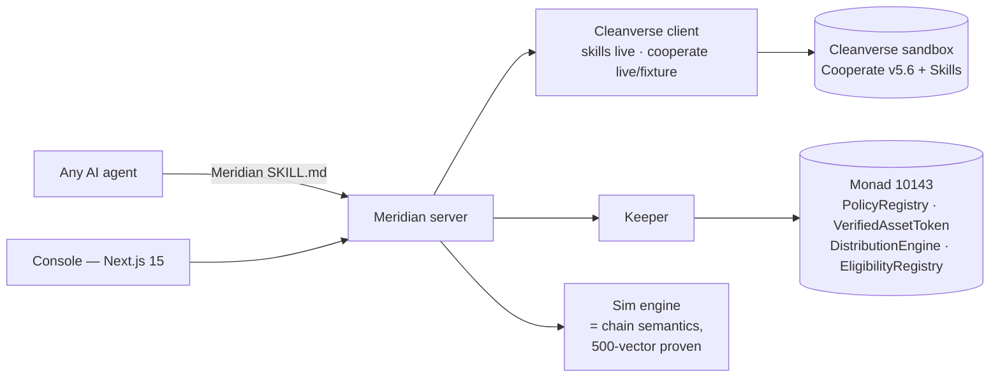

<div align="center">


# MERIDIAN

**Compliance that can see.**

*Meridian is pre-enactment proof for on-chain compliance: the blast radius of any policy change is computed, proven identical to what the chain will enforce, and anchored before the rule becomes law. The console is the interface to the primitive.*

**Cleanverse Build: Trusted Assets Hackathon · RWA Track · Deployed on Monad testnet (chain 10143)**

[](https://github.com/iamdflame/meridian/actions/workflows/ci.yml) · [**Live app**](https://meridian-three-olive.vercel.app) · [**Live Cooperate 9/9 receipt**](docs/evidence/live-cooperate-smoke.json) · [**Baseline policy receipt**](https://testnet.monadscan.com/tx/0x6a7fa416839357512000d78b68b5883b4c2c342318cbecf4dc441e87719115d0) · [**Seven-receipt deployment ledger**](docs/deployments.md)

Deployed: [EligibilityRegistry](https://testnet.monadscan.com/address/0x7e259bd022bef64d1Db3D65e5877C7A005c67B7F) ([tx](https://testnet.monadscan.com/tx/0xae4017b29918e3eea653edf898837332077e618621748a7f27d028a3fa61d2de)) · [PolicyRegistry](https://testnet.monadscan.com/address/0xB5C57CD5aB6592ca4FddD516161eDD3ba92BC818) ([tx](https://testnet.monadscan.com/tx/0x5dd951bba1b196de9afc7ec2ccb6cab7c0a2b1d739db9f7b76a1d6117c758e52)) · [VerifiedAssetToken](https://testnet.monadscan.com/address/0xD03a96319FB6fB4E702837c14021362e727446c7) ([tx](https://testnet.monadscan.com/tx/0xc3cf961ce639bc447fb86c80c46e95b17234ec5de36a3fb106ed261a0195265b)) · [SettlementToken](https://testnet.monadscan.com/address/0x40a57A703db976CF008D116AD594aF285F1a92eb) ([tx](https://testnet.monadscan.com/tx/0xeab5c44fbe46e045dd53d507b9c47f7d205a4aeaec7e8c1b7133876038f3ea48)) · [DistributionEngine](https://testnet.monadscan.com/address/0x9268aEc817615A79d363e3Bf156AC866eF398327) ([tx](https://testnet.monadscan.com/tx/0xb902eb8bc2fba0670372706bc0cba56bd86cf8dafb59b9d061bc361c09451299))

[Concept](docs/01-concept.md) · [Architecture](docs/02-architecture.md) · [Build report](docs/04-build-report.md) · [Deployments](docs/deployments.md)

<!-- Nano Banana Pro banner → docs/assets/banner.png (brief in docs/03-brand.md §4); replace this line with it when generated -->

</div>

---

## The problem

Every compliance policy an issuer enacts today is enacted **blind**. Legal writes a memo, ops updates a spreadsheet whitelist, and the desk discovers the blast radius as a breach report four weeks later. On Cleanverse, policy is *executable* — RuleV2 lives inside the asset. But nothing tells an issuer **what a rule will do before it becomes law**, or proves **exactly what it did** afterwards.

## The product — three verbs

1. **SIMULATE** — sweep the entire holder book (and every pending distribution leg) through a draft rule using the exact five-dimensional RuleV2 semantics the chain enforces. Every affected holder, every dollar stranded, every coupon that would fail — before you sign.
2. **ENACT** — one call writes the rule through the real Cleanverse API (`atoken/set_rule`), anchors the version in an on-chain hash chain on Monad, and flips live transfer behavior *at the token layer*: the same transfer that settled a second ago now refuses with the exact rule that blocked it.
3. **PROVE** — export the evidence pack: policy hash chain, affected-holder ledger, per-settlement Travel Rule references. A regulator doesn't trust Meridian — they recompute it.

And the part nobody catches on-camera: distribution legs that strand mid-flight **suspend into escrow** — money caught, not lost — releasable only when the chain re-proves eligibility.

## Why the simulation can be trusted

The TypeScript sweep engine and the Solidity transfer gate implement one semantics, defined once, and **500 seeded differential vectors are executed by both suites in CI** — if either implementation drifts, the build fails ([RuleVectors.t.sol](contracts/test/RuleVectors.t.sol) ↔ [rulev2.ts](packages/sim/src/rulev2.ts)).

## Cleanverse integration (the load-bearing table)

| Primitive | Endpoints / surfaces used | Role |
|---|---|---|
| **CVI** | `generate_apass` (seeds 48 identities), `query_apass`, `query_apass_list`, `verify_apass` (live reconciliation), `update_status` (freeze/reactivate lever), `get_magiclink` (remediation) | The book itself |
| **CVA** | `atoken/set_rule` / `add_rule` / `rules` / `set_paused`, `query_deposit_atoken_list`; full RuleV2 incl. v5.6 country lists | The enactment surface |
| **CCP** | `validator/register` (EIP-191), `validator/rules`; on-chain `checkTransfer` mirrors `complianceVerify` | The verdict layer (differentially proven) |
| **Travel Rule** | `download_travel_rule`, `query_txs` per settled leg | The receipts |
| **Agent Skill Framework** | Meridian **publishes its own skill** ([SKILL.md](server/skill/SKILL.md) + `/api/skills/query_book`, `simulate_policy`, `get_evidence`) — the exact pattern of Cleanverse's official `clevrpay` skill. Agents draft; only humans enact | The future seat |
| **Monad** | `PolicyRegistry` (hash-chain anchor), `VerifiedAssetToken` (live-read gate), `DistributionEngine` (suspense escrow), `EligibilityRegistry` (attested mirror) | The proof chain |

**Honesty is architectural:** every response carries `source: live | fixture`; every UI panel wears a provenance chip — `LIVE · SANDBOX`, `LIVE · MONAD`, or `SIMULATED`. The app degrades in labeled steps and never silently fakes.

## Quickstart (works first try, zero credentials)

```bash
git clone https://github.com/iamdflame/meridian && cd meridian
corepack enable && pnpm install

pnpm vitest run                                   # 23 unit tests
node --import tsx server/scripts/e2e-demo-path.ts # full demo path, 20 checks — fixture mode

# contracts (Foundry): install per https://getfoundry.sh, then
curl -sL -o .toolchain/solc-0.8.28 https://binaries.soliditylang.org/linux-amd64/solc-linux-amd64-v0.8.28+commit.7893614a && chmod +x .toolchain/solc-0.8.28
cd contracts && forge test                        # 22 tests + 500-vector differential parity

# full live-chain demo path (local anvil)
anvil --port 8545 &  # then, in another shell:
cd contracts && DEPLOYER_KEY=0xac0974bec39a17e36ba4a6b4d238ff944bacb478cbed5efcae784d7bf4f2ff80 \
  forge script script/Deploy.s.sol --rpc-url http://127.0.0.1:8545 --broadcast
cd .. && MONAD_CHAIN_ID=31337 MONAD_RPC=http://127.0.0.1:8545 \
  DEPLOYER_KEY=0xac0974bec39a17e36ba4a6b4d238ff944bacb478cbed5efcae784d7bf4f2ff80 \
  node --import tsx server/scripts/e2e-demo-path.ts   # 20/20 with real txs

# the console
node --import tsx server/src/index.ts &   # optional — the web app runs standalone in labeled demo mode without it
cd web && pnpm dev                        # http://localhost:3000
```

With hackathon credentials in `.env` (see `.env.example`), the same code paths run **live** against the Cleanverse sandbox — no code changes, the chips just turn green.

## Verified results

- **23** unit tests (client AES + lifecycle, sweep engine, seed determinism)
- **22** Foundry tests (eligibility matrix, policy-flip beat, escrow invariants, identity monotonicity, role separation)
- **500/500** TS↔Solidity differential vectors agree
- **20/20** e2e demo-path checks — in fixture mode *and* full-live-chain mode (real deploy, real reverts with decoded reasons, real escrow release)
- Live sandbox calls verified today, no credentials needed: `query_chain_config` (Monad 10143, aUSDC `0xaC08…f20D`), `get_magiclink`, `query_deposit_institutions` (Anchorage Digital)

Details with reproduction commands: [docs/04-build-report.md](docs/04-build-report.md) · Monad testnet addresses: [docs/deployments.md](docs/deployments.md)

## Architecture



## Why Cleanverse is essential (not decorative)

Remove CVI and there is no book. Remove CVA rule administration and there is nothing to enact. Remove CCP semantics and there is nothing to simulate. Meridian is not an app *gated by* Cleanverse — it is the operating seat *for* Cleanverse's own primitives, the module between the raw API and the institutions it is sold to.

## License

MIT — see [LICENSE](LICENSE).