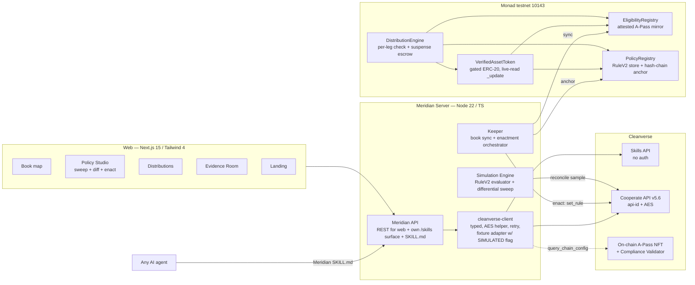

# 02 — ARCHITECTURE & MASTER PLAN

## 1. System overview



**Data model (server, in-memory + JSON snapshot):** `Holder{wallet, cvRecordId, tier, subTier, group, subGroup, country, status, expiry, source: live|simulated}` · `Position{wallet, assetId, balance}` · `Policy{version, rule: RuleV2, hash, parentHash, enactedAt, txHash}` · `Distribution{id, assetId, legs[]{wallet, amount, state: pending|paid|suspended|released, reason, travelRuleRef}}` · `SweepResult{policyDraft, perHolder[]{before, after, delta, reasons[]}, aggregates}`.

## 2. Chain choice — Monad testnet (justified)

Monad Foundation supports the event; Monad is first-class in Cleanverse chain enums (aUSDC); 300ms blocks make the enact→flip proof beat feel instant on stage; parallel execution narrative fits independent distribution legs. Known quirks pre-mapped (recon §2): logs chunked ≤90 blocks, `>=` timestamp comparisons, gas-on-limit → always simulate first, deferred exec → block-barrier in seed scripts.

## 3. Contracts

| Contract | Responsibility | Key design rules |
|---|---|---|
| `EligibilityRegistry` | Keeper-attested mirror of A-Pass state per wallet: `(cvRecordId, tier, subTier, group, subGroup, country, status, expiry)` | Mirror pattern (validated by field precedent): *"Cleanverse resolves wallet→identity off-chain; we project it on-chain because `_update` cannot make an HTTP call."* Binding survives freeze (revocation flips status only — never deletes identity). `KEEPER_ROLE` writes; batch upserts |
| `PolicyRegistry` | Active RuleV2 per asset + append-only version hash chain (`keccak(prev ‖ ruleStruct ‖ timestamp)`) | The evidence-pack spine. Rule struct mirrors real RuleV2: `groupAllow bytes2, subGroupAllow bytes2, minTier u8, minSubTier u8, countryList bytes2[], isBlackList bool, active bool` |
| `VerifiedAssetToken` | Demo RWA note (ERC-20). `_update` evaluates **live**: both legs verified against Registry × Policy | Never latch state; check `status==1 && expiry>=now && ruleMatch`; skip checks on mint/burn legs `address(0)`; custom errors w/ reason (`IneligibleCountry`, `TierTooLow`, `CredentialExpired`, `CredentialFrozen`) — legible refusals are a product feature |
| `DistributionEngine` | Coupon runs: per-leg re-verification at pay time → `pay / suspend`; suspended legs escrowed, `release(leg)` re-checks then pays; pull-claims | Invariant: `sum(escrowed) == sum(suspendedLegAmounts)`; CEI ordering; no push-loops over unbounded holders (paginated `payLegs(from,to)`) |

Solidity **0.8.28** (pin — 0.8.26 custom-error require trap), OZ 5.x, Foundry. Test matrix: gate eligibility (5 dims × status × expiry), transfer flip on policy change, escrow invariants, suspend→release lifecycle, registry monotonicity (identity never unbinds), access control per role, pagination bounds. Style: `if (!cond) revert Err()`.

## 4. Cleanverse integration map (per primitive, with honesty boundaries)

| Surface | Endpoints used | Auth | Live vs simulated boundary | Failure handling |
|---|---|---|---|---|
| Skills API | `query_chain_config`, `query_apass`, `get_magiclink`, `query_user`, `query_deposit_institutions` | none — **live always** | Live even without registration | 3× retry w/ backoff on transient; stable errors surface verbatim |
| Cooperate: CVI | `generate_apass` (seed book), `query_apass`, `query_apass_list`, `verify_apass` (reconciliation), `update_status` (freeze lever) | api-id + AES writes | Live once keys arrive; until then **fixture adapter** replays recorded shapes, every response tagged `simulated:true` → visible UI badge | Fail closed + legible: adapter maps failure → ineligible with reason, never opaque revert |
| Cooperate: CVA | `atoken/rules`, `add_rule`, `set_rule` (the ENACT write), `set_paused`, `query_deposit_atoken_list` | same | Enact runs live if keys allow rule writes on our sandbox A-Token; else enacts against fixture + on-chain PolicyRegistry (real tx) — badge states exactly which half is live | Rule writes serialized (one at a time, confirm before next) |
| Cooperate: CCP | `validator/grant`, `validator/register` (EIP-191 `sign(chain+address)`), `validator/rules`, `is_register` | same | Attempted live (Issue Member precedent); fixture fallback | Role-check at startup; degrade with explicit message |
| Travel Rule | `download_travel_rule`, `query_txs` | same | Live per settled tx hash where sandbox supports; else fixture-badged | Reports cached; time-limited URLs re-fetched on expiry |
| ASF | **We publish**: `SKILL.md` + `/api/skills/{query_book, simulate_policy, get_evidence}` on our server (mirrors official clevrpay pattern) | none (read-only by design) | Fully live (our surface) | Agents may draft, never enact — principal-signature boundary documented |
| Gateway/Rails | `query_deposit_institutions` displayed in Book (institution whitelist context); Access Core withdraw ABI documented as off-ramp path | — | Read-only live | — |

**The honesty invariant (product-wide):** every data panel carries a provenance chip — `LIVE · SANDBOX`, `LIVE · MONAD`, or `SIMULATED · FIXTURE` — and the demo says it out loud. Judges reward mastery, disqualify fakery.

## 5. Repo layout & toolchain

```
/contracts        Foundry — src/, test/, script/ (Deploy.s.sol, Seed.s.sol)
/packages/cleanverse  typed client: skills.ts, cooperate.ts, crypto.ts (AES/CBC/PKCS5 zero-IV), fixtures/
/server           Fastify + TS: routes/, sim/ (rulev2.ts, sweep.ts), keeper/, skill/ (SKILL.md + endpoints), seed/
/web              Next.js 15 (pinned), Tailwind v4, app router; app/(console)/..., app/page.tsx = landing
/docs             00…07 + deployments.md + decisions.md
/.github/workflows/ci.yml   forge test · vitest · eslint · tsc · next build
```

pnpm workspaces; Node 22; TS strict everywhere; env via `.env` (`CLEANVERSE_API_ID`, `CLEANVERSE_APP_KEY`, `CLEANVERSE_COOPERATE_BASE`, `CLEANVERSE_SKILLS_BASE`, `MONAD_RPC`, `DEPLOYER_KEY`) — never committed; server-signed demo txs (deployer key) rather than wallet-connect: fewer live failure modes, judges evaluate flows not MetaMask (recorded in decisions.md D-3).

## 6. Milestones (vertical slices; each ends runnable + tested + committed)

| M | Slice | Steps | Acceptance test |
|---|---|---|---|
| 0 | Scaffold | monorepo, CI, lint/type baseline, .env.example | CI green on empty slices |
| 1 | Cleanverse client | crypto helper; skills surface (live!); cooperate surface + fixture adapter; typed responses | vitest: AES round-trip, envelope parsing, fixture replay; live smoke: `query_chain_config` prints chains incl. monad |
| 2 | Contracts | Registry → Policy → Token → Distribution, full test matrix | `forge test` green; gate matrix + escrow invariant + flip test |
| 3 | Deploy + seed | Deploy.s.sol to 10143; seed book: ~50 identities (API or fixtures) + positions + scheduled coupon run; block-barrier scripts | docs/deployments.md w/ addresses + explorer links; seeded state queryable |
| 4 | Simulation engine | rulev2.ts pure evaluator; sweep runner; differential reconciliation vs contract + vs `verify_apass` sample | property test: sim verdict == contract verdict on 500 randomized holders×rules; reconciliation script output |
| 5 | Server + keeper + enact | REST for web; keeper sync; enact orchestration (API write → PolicyRegistry anchor → registry refresh); evidence pack builder; own skills surface | headless e2e script: draft→sweep→enact→on-chain flip proof→coupon run→suspend→release→evidence JSON; zero manual steps |
| 6 | Console UI | Book, Policy Studio (sweep+diff+enact), Distributions, Evidence Room, Agent view — from Phase-3 design system | demo path clicks through with zero console errors @1440/1024/390 |
| 7 | Landing + polish | landing page, signature interaction tuning, SKILL.md publication, README | Lighthouse sanity; visual audit vs craft checklist |
| 8 | Ship | Vercel deploy, cold-browser test, screenshots, ui-audit doc, submission copy | every link works logged-out; /docs/05 + /docs/06 complete |

**Demo-critical path:** M1 → M2 → M3 → M5 → M6 (Studio + Book). Everything else enhances but cannot block.

## 7. Risk register

| # | Risk | Impact | Mitigation |
|---|---|---|---|
| 1 | API keys never arrive (registration window) | Cooperate surface dark | Skills API live regardless; fixture adapter w/ honest badges; on-chain flow fully independent; HUMAN ACTION #1 outstanding |
| 2 | Sandbox flaky on demo day (documented 500s, faucet outage) | Live beats fail on stage | Retry-transient client; every live panel has fixture twin; demo script marks which beats are chain-only (immune) |
| 3 | Monad faucet gated / deployer unfunded | No deployment | HUMAN ACTION #2 (fund one address); anvil fallback for local proof while waiting; contracts identical either way |
| 4 | 48h scope blowout (the field's #1 killer) | Half-finished everything | Vertical slices with hard acceptance gates; M6 screens ranked: Studio > Book > Distributions > Evidence > Agent; cut from the bottom |
| 5 | Sim/contract semantic drift discovered late | Credibility hit in Act 2 | M4 differential property test is a *gate*, not a nice-to-have; single source of truth: rule struct defined once, codegenned to TS + Solidity constants |

## 8. Quality harness

- **Contracts:** Foundry unit + invariant tests; the eligibility matrix is table-driven; `forge fmt` + solhint-style review; no `via_ir` needed (0.8.28).
- **TS:** ESLint (typescript-eslint strict), Prettier, `tsc --noEmit` in CI; Vitest for client/sim/server units; the M5 headless e2e is the demo-path smoke test, run in CI against anvil + fixtures.
- **CI:** GitHub Actions single workflow: install → lint → typecheck → vitest → forge test → next build. Red CI blocks merge to main (self-imposed).
- **Security pass (Phase 4 exit):** OWASP top-10 review on server (input validation via zod at every route boundary, no secrets in code, structured errors, rate limits on skills surface); contracts: reentrancy (CEI + pull payments), access control matrix test, integer/rounding review, no oracle assumptions beyond keeper attestation (documented trust model).
